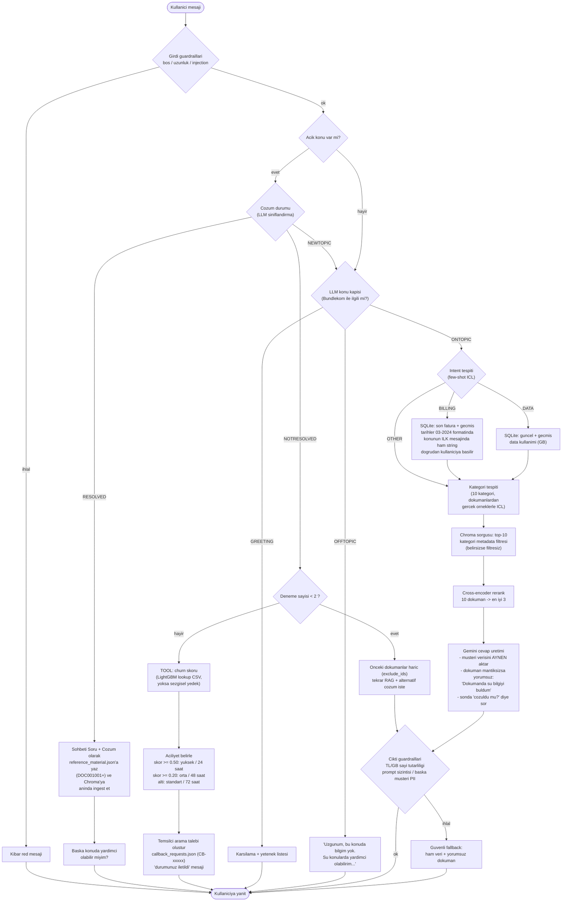

# Bundlekom Agent — Akis Diyagrami

## Okuma notlari

- **Acik konu**: Asistan bir cozum onerdikten sonra konu "acik" kalir; bir
  sonraki mesaj once cozum geri bildirimi mi (RESOLVED / NOTRESOLVED) yoksa
  yeni bir soru mu (NEWTOPIC) diye siniflandirilir.
- **LLM cagrilari** (mesaj basina 3-4 adet, hepsi flash): konu kapisi,
  intent/cozum-durumu, kategori, cevap uretimi.
- **State**: sohbet gecmisi (`history`), acik konu (`topic`: intent, kategori,
  deneme sayisi, kullanilan dokuman id'leri, acilis mesaji), oturum sonunda
  `data/sessions/` altina JSON olarak yazilir.
- **Veri katmani**: `data/bundlekom.db` (SQLite, 4.3M harcama satiri) ve
  `data/chroma/` (1000+ dokuman; cozulen sohbetlerle buyur).
